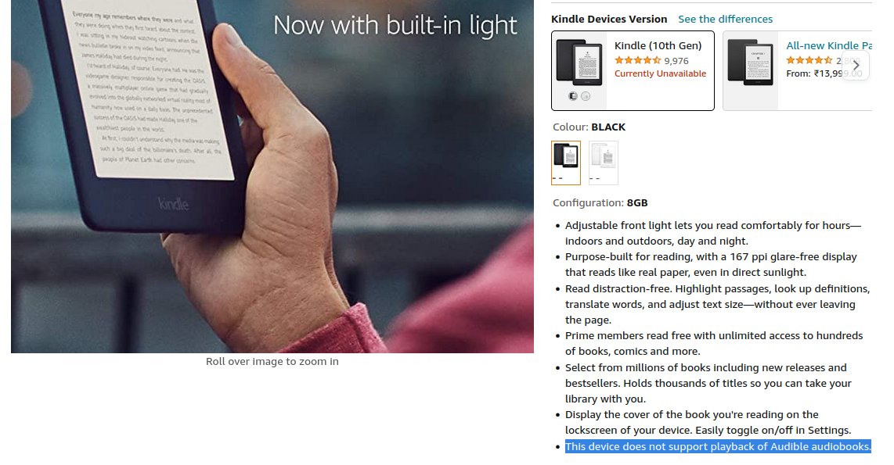
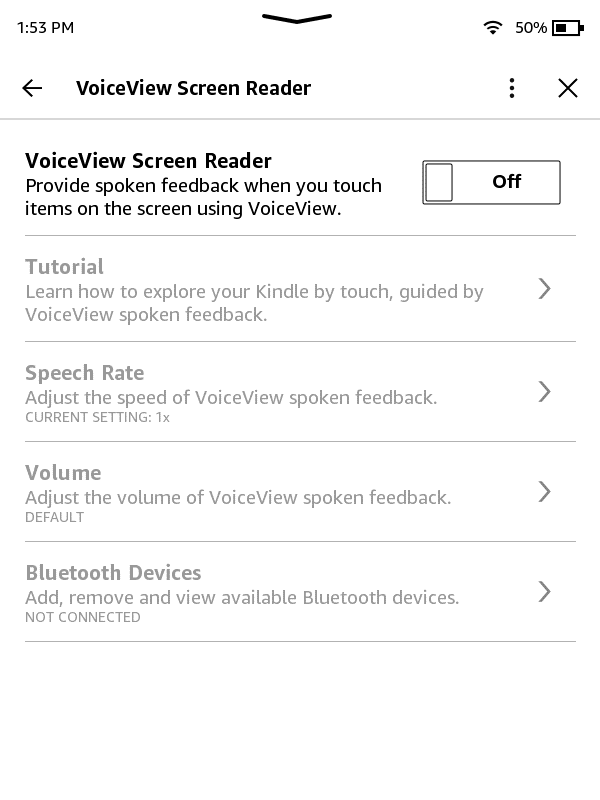
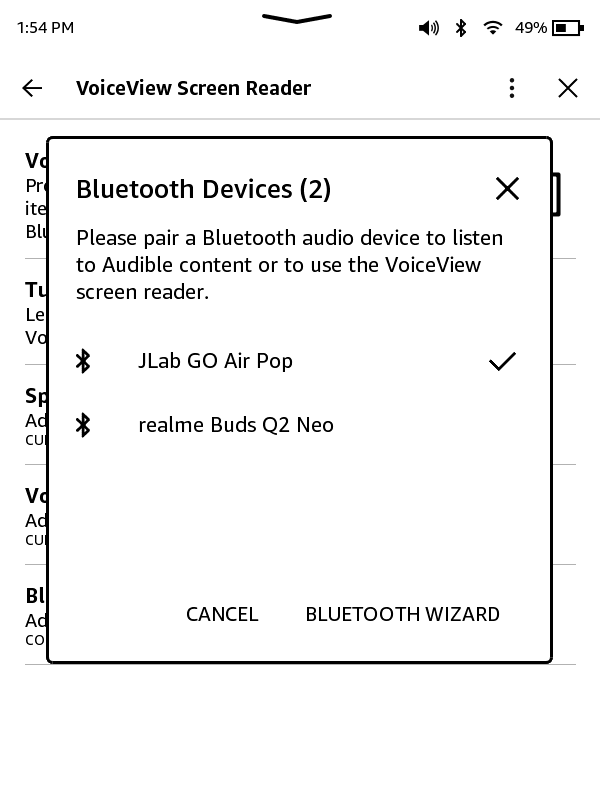
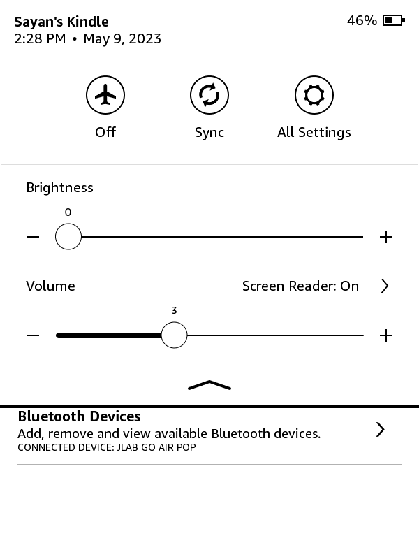

### Wait, what's a Kindle?

If you're a bookworm like me or just a student who needs to read from a lot of digital notes (thanks to Covid-19), chances are that you've at least heard about the Amazon Kindle. It's a device that's been designed from the ground up exclusively for reading stuff. E-books, PDFs, text-based websites, you name it. You can read it all on the Kindle.

### Since you're saying it's only meant for reading, why should I even bother with *listening* on a Kindle!?

Most people who have a Kindle will almost always also have a smartphone of some sort. You can easily use your smartphone to listen to audiobooks from Spotify, Audible, etc. So why bother doing this on a Kindle? Well, let's talk about it.

* Your smartphone probably has a lot of different types of apps installed on it. You may get distracted by all these apps trying to grab your attention when trying to focus on listening to audiobooks on your phone.
    
* Reading the book off of the Kindle while listening to it can provide a more immersive experience and help you retain the information longer, because both your eyes and ears are focused on the same thing. It's very helpful in noisy environments.
    
* I like to tinker around with the devices I own, so if you're like me, you'll love this neat little trick!
    

### What kind of books can I listen to?

* The book must be Text-to-Speech enabled.
    
* Currently, the only supported language is English.
    
* You need to disable the passcode on your Kindle if you have one. It's a limitation of Amazon's VoiceView Screen Reader.
    

I have the 10th Generation Kindle, which does not support the playback of Audible audiobooks, as per Amazon. Also, there's no obvious mention of the fact that you can listen to all your text-to-speech-enabled e-books using a Bluetooth speaker.

<!--  -->

> This tutorial should work for any Kindle that supports Amazon's VoiceView feature using Bluetooth. I'll be using my **JLab Earbuds** & the **10th Gen All-New Kindle** (that's literally what it was called back in 2021) for the demonstration.

### So how do I do it?

Good question. This is how:

* First, head to the Settings section of your Kindle (Swipe down &gt; All Settings).
    
* Navigate to **Accessibility** &gt; **VoiceView Screen Reader**.
    

<!--  -->

* Put your Bluetooth Audio device in '**pairing mode**', then turn the toggle 'On'. The Kindle will automatically enable Bluetooth and start searching for audio devices around it.
    
* After some time, your Kindle should automatically connect to your Bluetooth speaker. In case it doesn't, tap on '**Bluetooth Devices**', then select your speaker from the list.
    

<!--  -->

* At this point, your speakers should be connected and you should be good to go!
    

> However, since this is an accessibility feature, you will notice a change in how the UI responds to your input. This change will persist as long as VoiceView is enabled.

* Now, to select an item on the screen, tap on it once. To execute it, tap twice.
    
* The voice assistant will automatically start reading the current page contents of a supported book once you open it.
    
* To access the 'Reading Options' panel while you're in reading mode, double tap anywhere on the screen.
    
* You can change the volume or turn Screen Reader off from the drop-down menu.
    

<!--  -->

> Quick Tip: You can hold the **top-left** & **bottom-right** corner (or the **top-right** & **bottom-left** corner) of the Kindle screen to take a screenshot! You can then connect the Kindle to a PC/phone to view them.

So this is how you can 'listen' to your books on a Kindle. Happy Reading & Listening!