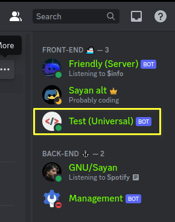

Imagine you have made a Discord bot in Python. Now, after testing, you want to run it on a Linux server. The typical way of running it is:

```bash
$ python /path/to/bot.py
```

However, this is not exactly the best way to run the bot, because:

* Your bot will stop working the moment you log out or exit the terminal session.
    
* Your bot will not start running *automatically* if you reboot or re-login to the server's command line interface.
    
* The bot won't automatically restart itself in case there's a failure due to a runtime error. You have to manually connect to your server and start it back up.
    

As we can see, there's a lot of manual intervention that needs to be done if you want your bot to keep working with minimum downtime. The solution to this is to use in-built tools in Linux to automate most of this manual work. This is where systemd comes in.

> Systemd is a service manager, that runs as PID1 and manages services for the rest of the Linux system. You can run a particular service as a system service, or as an user service. Systemd runs services as a 'daemon', where a daemon is essentially a background service that waits for events to occur or provides a service on a specific port.
> 
> Head on to the [ArchWiki](https://wiki.archlinux.org/title/Systemd) if you want to learn more about it.

So, without further ado, let's see how we can create our service to run our bot.

## Prerequisites

* Verify that the bot works properly.
    
* Note down the full path of both the command & the path where the bot's code is written. In my case, it is:
    
    Python: `/usr/bin/python`
    
    Bot: `/home/sayan/bot.py`
    

## STEP 1: Create the service

In my case, I want to run my bot as a system service under root. So, my bot's service file will go in `/etc/systemd/system`. So, create the `bot.service` file in the directory.

```bash
$ nano /etc/systemd/system/bot.service
```

Then, paste these lines into it:

```bash
[Unit]
Description=Discord Bot
After=multi-user.target network-online.target

[Service]
WorkingDirectory=/home/sayan/
ExecStart=/usr/bin/python /home/sayan/bot.py
Type=idle
Restart=on-failure
TimeoutStartSec=5
RestartSec=2

[Install]
WantedBy=multi-user.target
```

There are a lot of things in this file, but here are the basics:

* **After=multi-user.target network-online.target**: This means the service will wait for the system to reach a state where any user can log in, and it'll also check if the network is online, *before starting the service*.
    
* **ExecStart=/usr/bin/python /home/sayan/bot.py**: The command to execute. Providing the full paths is mandatory here.
    
* **Restart=on-failure**: Automatically restart the service in case a failure occurs.
    
* **TimeoutStartSec=5**: The amount of time to wait for the service to start, before assuming it's failed to start.
    
* **RestartSec=2**: The amount of time to wait before restarting the service.
    

> Remember that this is a configuration that works on my server, you can tweak it as per your needs. Check the [ArchWiki](https://man.archlinux.org/man/systemd.unit.5) for all available options.

## STEP 2: Run the service

After you've saved the `bot.service`, it's time to reload the systemd daemon (so that it accepts the changed configuration), and run the service!

```bash
$ systemctl daemon-reload    # Reload the daemon
$ systemctl start bot        # Start the service
$ systemctl status bot       # Check the status
● bot.service - Self/Test Bot
     Loaded: loaded (/etc/systemd/system/bot.service; disabled; preset: disabled)
     Active: active (running) since Fri 2023-08-25 09:37:09 IST; 6s ago
   Main PID: 145520 (python)
      Tasks: 3 (limit: 18779)
     Memory: 28.2M
        CPU: 374ms
     CGroup: /system.slice/bot.service
             └─145520 /usr/bin/python /home/sayan/bot.py

Aug 25 09:37:09 Client0-Sayan systemd[1]: Started Discord Bot.
Aug 25 09:37:09 Client0-Sayan python[145520]: [2023-08-25 09:37:09] [INFO    ] discord.client: logging in using static token
Aug 25 09:37:11 Client0-Sayan python[145520]: [2023-08-25 09:37:11] [INFO    ] discord.gateway: Shard ID None has connected to Gateway (Session ID: xxxxxxxxxxxxx)
```

Also, if you check the member list, you should be able to see your bot online in there.



## STEP 3: Auto-start your service at boot (Optional)

'Enabling' the service ensures your bot will start back up automatically every time your server reboots. You should consider this option if you want the bot to stay available at all times with minimum manual intervention.

```bash
$ systemctl enable bot
Created symlink /etc/systemd/system/multi-user.target.wants/bot.service → /etc/systemd/system/bot.service.
```

This is it! This is how you can create your very own service and utilise the capabilities of systemd to run your own bots!